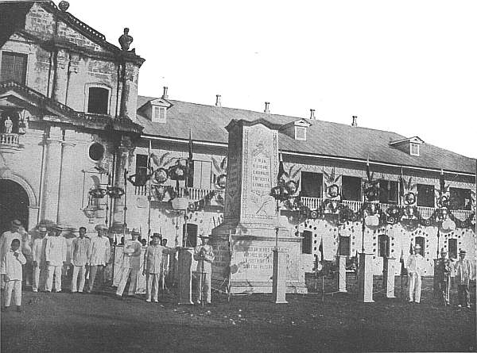
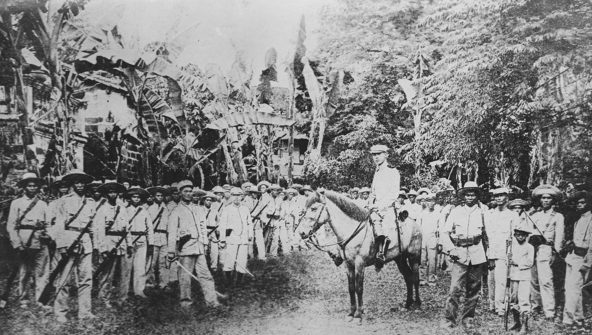

Revolution is a cornerstone of Philippine history, evident in the numerous stories of Filipinos trying to break free from the colonial grasp of multiple powers. It should come as no surprise that in the process of revolting, the Malolos Republic was a revolutionary one at its core. Like other governments, the First Republic established both civilian and military aspects, with some of these laws bolstering their army, and others keeping them in check. The laws of the Malolos Republic were meant to prioritize civil supremacy over the military. However, various interpretations of the laws gave way to a rise in militarism, failing to keep the army in check. 

Historiographic accounts of the Malolos Republic have documented civil-military tensions in the government after Aguinaldo’s return in 1898\. This paper examines how this tension manifested in the laws of the Malolos Republic proclaimed by Aguinaldo through his Decrees right after his declaration of independence, and eventually the 1899 Malolos Constitution. 

# **Malolos in 1898**

The Philippine Revolution had come to a stalemate at the start of 1898\. As part of the pact of Biak na Bato, Emilio Aguinaldo had left the Philippines on December 27, 1897 to Hong Kong, effectively halting the Revolution[^1]. Tension in the Philippines remained until May 1, 1898, when Spain was defeated in the battle of Manila Bay by the U.S. Navy. With the Spaniards losing dominance of Manila Bay, their control over the rest of the Philippine Islands had begun to loosen, prompting Aguinaldo’s return to the Philippines on May 19\. 

Aguinaldo returned to a nation eager for independence. The latent nationalistic zeal of revolutionaries, as well as common people, inculcated by the Propaganda Movement but stalled in the stalemate,  had now exploded. Aguinaldo responded to this eagerness in kind: not even a month later, on June 12, Aguinaldo proclaimed the independence of the Philippines in Cavite. A few days later on June 18 through a decree, he established a “Dictatorial Government with full authority, civil and military, in order to determine first the real needs of the country”.

Looming in the background, however, was the threat of US invasion. Although the US fought off the Spaniards and urged Aguinaldo to return, and the Philippines gave their gratitude for the country’s “disinterested protection of the Philippines” in the Declaration of Independence, the republic was still wary of the US. Thus two of the primary objectives of the nascent government were to (1) drive out the Spanish officials and friars in towns, and (2) prepare for the threat of US invasion at the same time. On the other hand, as a government serving as the foundation for “a Republic of the Philippines as a government of the people, by the people, and for the people.”, and facing a Filipino people with a hunger for democracy inculcated by the Propaganda Movement, an arguably greater objective of the government was to represent the people. 

This sets the stage for the civil-military conflict which plagued Aguinaldo and the Revolutionary Congress. The problem is that in wartime, the military may be inclined to oppose civilian supremacy, a phenomenon called militarism. As we will see, Aguinaldo was cognizant of the perils of militarism and in his decrees explicitly took measures to curtail their power. Nevertheless, the reality of the wartime situation compelled Aguinaldo to place certain responsibilities on the military which sometimes overlapped with the civil functions of the government. 

# **Civilian Supremacy**

The concept of civilian supremacy is of utmost importance in a democratic state. The military, as a tool of the government, is meant to serve the best interests of the people. However, as the military yields a monopoly on violence, various measures must be taken to curtail its powers. One measure in today’s societies, for instance, is that the military answers to a commander-in-chief who is a civilian; a stark contrast from the past, where a general had full authority to lead the military in Aguinaldo[^2]. The commander-in-chief, head of the executive branch of government, in turn, answers to the legislative branch, who represent the “voice of the people”. However, in wartime, when quick decision making is of paramount importance and the military plays a heightened role for the wellbeing or even the very existence of the state, many duties typically performed by elected officials and civil servants must be taken over by the more forceful elements of the government such as the police and military.  
	  
Aguinaldo and his advisors were chiefly aware of this civil-military paradox and sought to resolve it by drawing a clear line between civil and military functions through various decrees he proclaimed in Malolos, starting from June 18\. These decrees formed the basis for administration of provinces and towns who had driven out or were in the process of driving out Spaniards and were facing the concurrent challenge of political reorganization (or political decolonization). And these later on, with few adjustments, became the basis for the eventual Malolos Constitution in 1899\. To understand how these decrees, which is referred to as the Laws of Malolos or simply the Laws in the sequel, attempted to balance civil-military power in turbulent times, it is important to understand the structuring of provinces and towns, which provides us with clues with whom civil and administrative power resided in these areas.

# **Political Structure under the Republic**

The first three decrees detail most of the structure of the early Malolos government and the provinces and towns under it. We limit our description to the structures most relevant to civil and military duties. Aguinaldo initially established a Dictatorial government in the June 18 decree, which he later changed to a Revolutionary government in his June 23 decree. Aguinaldo’s first decree in June 18, which we may construe as the utmost priorities of the Dictatorial Government, instructed each town to gather in one big assembly to vote in the town mayor, the heads of each barrio, a chief of police, a chief of law and justice, and a chief of revenues and properties, whom collectively constitute the Popular Assembly or simply the Town Assembly. On a provincial level, the Provincial Assembly would consist of these town mayors who, among themselves, vote for the Governor of the Province and three councilors for a provincial chief of police, a chief of law and justice, and a chief of revenues. Crucially, the government would appoint a civilian commissioner to preside over the province and enforce the decree, which mostly concerns elections. Confusingly, however, Article 9 also states that the military chiefs who freed the towns from Spanish occupation are commissioners by right. With the Decree of June 23, four department secretaryships were also created to assist Aguinaldo, with one of them being a Secretaryship of War that was further divided into four divisions and wholly managed by civilian officials; One for military administration and logistics, another for enlistment and registry, the third for military justice, and the fourth was in charge of sanitation and wellbeing regarding the militias. Later on, the Secretaryship of War was reorganized through the Decree of September 26 in order to introduce divisions for both engineering and artillery.[^3] 

Furthermore, the Revolutionary government established the Revolutionary Congress consisting of Representatives from all the provinces of the Philippines. This Congress was tasked with creating laws for the government and they would eventually create the Malolos Constitution in 18994.

# **Civil-Military Delineations** 

The Laws separated the civil and military elements of the government in its articles, but repeated throughout the Laws are various exceptions to these clauses in times of “real need”. For instance, Article 8 of the June 18 Decree which forbade provincial military chiefs from participating in administrative duties contained an exception for times of “actual threat”[^4]. In the Decree of June 20, Rule 12 stipulated that local town mayors would organize police forces and have authority regarding their executive decisions; however, these forces were placed under the command of a lieutenant in the army. Rule 13 decrees that the local force must listen to the local civil officials, and this is immediately followed by Rule 14 on the organization of police forces stating that upon consent, the military leaders may utilize the forces provided proper consent. Again the spirit of the law takes the side of civilians while making leeway for military usurpation if necessary.[^5]  

The Laws also contained intersections between the jurisdiction of elected officials and military officers which were left unclarified and open to interpretations. Rules 18-30 contained instructions for the carrying out of the census in each town among other civil duties; Led by the Deputy on Justice, they would keep the records of births, children, marriages, etc. This is tied into the responsibility of the chief of police to keep a record of each individual and their military qualifications according to Rule 16\. Rule 22 stipulated that “Those in the service of the Revolutionary Militia and members of the police force utilized by the provincial military commanders, shall be tried by the Councils of War”, creating an ambiguity over the judicial process for military members and overstepping the responsibility of the justice deputy[^6].   
	  
It would not only be the writing of the laws that blurred the lines between civil and military during this period. It sometimes happened that the civil officials who were elected were members of the principalia, former provincial or town officials during the Spanish period, who were deeply connected to the military and often commanded private armies themselves[^7]. 

# **Signs of Cracks in the Civil-Military Divide**

On February 4, 1899, US forces would come into direct contact with the Philippine Revolutionary Army, recorded by Emilio Aguinaldo in his manifesto[^8]. Although the outbreak of the Philippine-American war did not immediately lead to the military undermining civilian rule, distrust between civilian and military leaders began to sow. 

Due to sudden hostilities with the US, Aguinaldo declared on February 4 that grants military officials greater power than civilian officials throughout Luzon. Such an order was viewed by civilian leaders as a violation of the original decrees issued by Aguinaldo regarding the subservience of the military to the civilian government. In response to the backlash from civilian government officials, Aguinaldo would backtrack on his declaration and reaffirm the original stance of military subservience. It was from this point that the military slowly but steadily began its usurpation of power throughout 1898, accelerating the outbreak of the Philippine-American War. 

It is important to note, however, that the civilian government was already having trouble with controlling the military prior to the outbreak of the war. A noteworthy chain of events was described in a report dispatched to President Aguinaldo, which was sent on December 27, 1895, at 5 in the morning. The report stated that the discontent in the provinces of Pangasinan, Tarlac and Yloco (Ilocos) was increasing, and that the town of Bangbang rose in revolt on the 25th and 26th of that month, where they killed all of the civil officials due to the tension caused by the abuse of power by both military and civil authorities[^9]. Civilian leaders across various provinces complained to the central government about their loss of control. Officials in Bataan, Zambales, Tayabas, and Isabela, reported provincial military commanders as having invaded the office of civilian officials, leading them to be left virtually powerless. To add insult to injury, these civilian officials were often blamed by the public for whatever abuses the military carried out.  
	  
To combat the rise of militarism, Apolinario Mabini would write a letter to Aguinaldo urging him to take control of the military as a strong executive, on February 28, 1899\. Mabini argued that Aguinaldo’s military dictatorship was necessary not for the subjugation of the townspeople but to repress the abuses of the army. He hoped that Aguinaldo could use his powers as chief of the army to have soldiers be subservient to him, where can force them to stop their abuses[^10]. However, Mabini’s request for a military dictatorship led by Aguinaldo was a direct contradiction to Article 4 of the Constitution, which states that “The Government of the Republic is popular, representative, alternative, and responsible, and shall exercise three distinct powers: namely, the legislative, the executive, and the judicial. Any two or more of these three powers shall never be united in one person or cooperation, nor the legislative power vested in one single individual.”, emphasizing a clear separation of powers that was to prevent a single individual or cooperation from taking more than one position, namely the legislative, executive, and judicial arm of the government.   
	  
In addition to Article 4, a military dictatorship conflicted with several other articles of the Constitution. Titles 5 and 6, according to Calderon, established that the legislative arm of the government was to act as a counter-force to the military. This legislature was meant to ensure that the President of the Republic and other military officials could be tried for violating the titles and acts of the constitution. A military dictatorship would bypass this legislative supremacy. A military dictatorship would have also threatened the bill of rights granted to citizens[^11]. Interestingly enough, Mabini himself would recognize this contradiction and attempt to defend his stance by stating that it was not possible for the government to honor civil liberties in a time of war, where military dominance is necessary. Article 30 states that even in times of heightened tensions, the constitution could only be suspended temporarily, requiring approval of the national assembly. Therefore, Aguinaldo could not unilaterally impose a military dictatorship without violating the constitution, which mandated legislative approval. 

# ***Guardia de Honor***

Although many abuses by the military occurred in various parts of the Philippines, it was the *Guardia de Honor* who perhaps provides the starkest example of how provincial instability forced the civilian government to rely on the military, which in turn bypassed constitutional safeguards meant to prevent dissent. The Guardia de Honor were originally created by Spanish authorities to “provide a devout escort for the Virgin’s image during sacred processions”, and this group would go on to transform into a radical anti-elite peasant movement after the Spanish Friars were arrested or fled during the revolution. The Guardia de Honor blamed the revolutionary movement for the loss of their spiritual guidance, leading to an uprising against the Malolos Republic across Pangasinan, Tarlac, and La Union in late 1898 and early 1899\. In their uprising, they would go onto pillage government buildings, destroy official records, and violently attack prominent families loyal to Aguinaldo’s government. In an attempt to establish a safe haven for their operations, they would form a massive theocratic communal society in Cabaruan, Pangasinan, where tens of thousands of peasants migrated after confiscating rice, livestock, and lands from wealthy *principales*. The inability of the civilian government to maintain order caused immense panic among provincial elites, leading civilian administrators in Tarlac to desperately telegraph Aguinaldo for military reinforcements, martial law, and the creation of armed militias to protect them from the peasants[^12]. The military’s response to the Guardia de Honor totally undermined the newly drafted Malolos Constitution, particularly its bill of rights, which explicitly stated that no Filipino could be prosecuted or sentenced except by a judge and competent court based on Article 14\.   
	  
A specific example of this constitutional subversion occurred in Tarlac, which involved a faction of the Guardia de Honor led by ex-seargent Pedroche. Pedroche and his faction successfully took control of four towns and gathered immense popular support[^13]. Fearing of Pedroche’s growing influence, Aguinaldo’s military commander of Tarlac bypassed all legal and civilian procedures, resorting instead to treachery and mass murder . This was done by the local town president, who was loyal to the president, inviting Pedroche and his officers to a festivity under the pretense of recognizing Pedroche as his chief. After the meal, Pedroche and his offers were ambushed by the military and quickly executed. Therefore, instead of dealing with the rebels through the legal framework established by the constitution or courts utilized by the civilian government, the revolutionary military routinely hunted down and performed extrajudicial executions. This highlights that, despite the Malolos Constitution's guarantees of individual liberties and civilian supremacy, the military operated with unchecked dictatorial power in the provinces whenever the state was threatened. 

# **Conclusion**

The Philippine Revolution was a paradox due to the inherent conflict between the civilian and military government. Although the revolutionary government attempted to establish civil supremacy through a strong legislature heralded by Calderon, the Malolos Republic was busy dealing with two other primary objectives: Driving out Spanish officials and the looming war with the United States. Although these three objectives were all part of a revolutionary government representing a populace eager for independence, driving out Spanish officials and war preparations drove militarism to a level where disorder and strife among members of the army would become prevalent. Aguinaldo was aware of the civil-military paradox that was engendered by the circumstances faced by the revolutionary government, leading him to a political structure with popular assemblies and provincial assemblies, including town mayors, chiefs of police, and provincial governors. Local town mayors and provincial governors were even given authority over local forces. Military officials were required to seek explicit consent from civilian officials before utilizing local forces, and military chiefs were explicitly instructed not to intervene in the government’s civil affairs. Despite the laws, however, it did not take long before military officials began to claim the same prerogatives as municipal officials. The outbreak of the Philippine-American war on February 4, 1899, accelerated this trend, with reports of military commanders invading the offices of civilian officials becoming commonplace. These would form a feedback loop that was exacerbated by Mabini urging Aguinaldo to use his executive power as a military dictatorship, as well as civilian administrators desperately requesting military reinforcement and martial law, where the military consistently bypassed constitutional guarantees of civil liberties.   
	

**Bibliography**

Aguinaldo, Emilio. *True Version of the Philippine Revolution*. Tarlac, 1899\. Reprinted, Manila: National Historical Institute, 1969\.

Aguinaldo, Emilio, “Decree of September 26, 1898, Regarding the Administration of Abandoned Properties and the Collection of Taxes,” in *The Laws of the First Philippine Republic (the Laws of Malolos) 1898–1899*, ed. Sulpicio Guevara (Manila: National Historical Institute, 1972), 30–32. 

Bautista, Ambrosio Rianzares. "Philippine Declaration of Independence." June 12, 1898\. Wikisource. Last modified August 19, 2023\. [https://en.wikisource.org/wiki/Philippine\_Declaration\_of\_Independence](https://en.wikisource.org/wiki/Philippine_Declaration_of_Independence).

*Encyclopedia Britannica*. s.v. "Philippine Revolution." Last modified March 27, 2024\. [https://www.britannica.com/event/Philippine-Revolution](https://www.britannica.com/event/Philippine-Revolution).

Guerrero, Milagros. "The Provincial and Municipal Elites of Luzon During the Revolution, 1898–1902." In *Philippine Social History: Global Trade and Local Transformations*, edited by Alfred W. McCoy and Ed. C. de Jesus, 155–190. Quezon City: Ateneo de Manila University Press, 1982\.

Mabini, Apolinario. "Decree of June 18, 1898, Establishing the Dictatorial Government." In *The Laws of the First Philippine Republic (the Laws of Malolos) 1898–1899*, edited by Sulpicio Guevara, 10–12. Manila: National Historical Institute, 1972\.

Mabini, Apolinario. "Decree of June 20, 1898, Providing Instructions for the Administration of Provinces and Towns." In *The Laws of the First Philippine Republic (the Laws of Malolos) 1898–1899*, edited by Sulpicio Guevara, 13–19. Manila: National Historical Institute, 1972\.

Mabini, Apolinario. "Decree of June 23, 1898, Establishing the Revolutionary Government." In *The Laws of the First Philippine Republic (the Laws of Malolos) 1898–1899*, edited by Sulpicio Guevara, 20–27. Manila: National Historical Institute, 1972\.

Majul, Cesar Adib. "A Legislature or a Dictatorship?" In *Mabini and the Philippine Revolution*, 160–180. Quezon City: University of the Philippines Press, 1960\. 

Naval History and Heritage Command. "Battle of Manila Bay: Miscellaneous Documents." Selected Documents of the Spanish American War. Last modified April 16, 2015\. [https://www.history.navy.mil/research/library/online-reading-room/title-list-alphabetically/s/selected-documents-of-the-spanish-american-war/battle-of-manila-bay-miscellaneous-documents.html](https://www.history.navy.mil/research/library/online-reading-room/title-list-alphabetically/s/selected-documents-of-the-spanish-american-war/battle-of-manila-bay-miscellaneous-documents.html).

Paterno, Pedro A. "The Pact of Biak-na-Bato." December 14, 1897\. In *The Philippine Insurrection Against the United States: A Compilation of Documents with Notes and Introduction*, edited by John R. M. Taylor. Vol. 1\. Pasay City: Eugenio Lopez Foundation, 1971\.

Taylor, John R. M.,  "Organization of Municipal Governments," in *The Philippine Insurrection Against the United States: A Compilation of Documents with Notes and Introduction*, vol. 1 (Pasay City: Eugenio Lopez Foundation, 1971), 35\. 

Taylor, John R. M. "Telegram to the President of the Revolutionary Government from the Director of Diplomacy, Dec. 27, 1898." In *The Philippine Insurrection Against the United States: A Compilation of Documents with Notes and Introduction*. Vol. 2, 36\. Pasay City: Eugenio Lopez Foundation, 1971\. 

Taylor, John R. M., "The Guardia de Honor and the Case of Juan Pedroche," in *The Philippine Insurrection Against the United States: A Compilation of Documents with Notes and Introduction*, vol. 2 (Pasay City: Eugenio Lopez Foundation, 1971), 93–95.

"The 1899 Constitution." Lawphil Project. Accessed May 12, 2026\. [https://lawphil.net/consti/con1899.html](https://www.google.com/search?q=https://lawphil.net/consti/con1899.html).   

[^1]: Bautista, "Pact of Biak-na-Bato," para. 1\. 

[^2]:  Encyclopedia Britannica, "Philippine Revolution." 

[^3]:  Mabini, “Decree of September 26”, art. 2, para. 2

[^4]:  Mabini, "Decree of June 18," art. 8., art. 11

[^5]:  Mabini, "Decree of June 20," rules 12–14 

[^6]:  Mabini, “Decree of June 23”, rules 16-30

[^7]:   (Guerrero, *Provincial Elites*, 173\)

[^8]:  Aguinaldo, "True Version," chap. 19\. 

[^9]:  Director of Diplomacy, “Telegram, Dec. 27, 1898,” 2:36 

[^10]:  Majul, 185

[^11]:  *The LawPhil Project*, Art. 6-32

[^12]:  Sturtenvart, *Guardia de Honor,* 345-347

[^13]:   Taylor, "Guardia de Honor," 2:93. 
